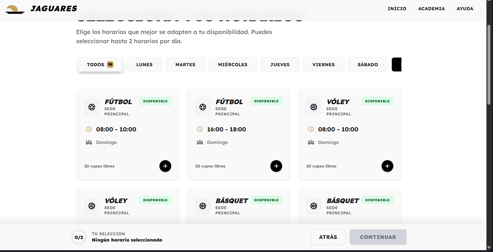

# INICIO RÁPIDO - JAGUARES

## 🚀 Pasos para Ejecutar

### 1. Iniciar el Backend

```bash
# En una terminal, ir al proyecto backend
cd "C:\Users\Cris\Desktop\campamento - copia (2)"

# Iniciar el servidor (ya debe estar configurado)
npm start
```

El servidor debe estar corriendo en: **http://localhost:3002**

### 2. Configurar Variables (Primera Vez)

```bash
cd jaguares-funcional

# Copiar archivo de ejemplo
copy .env.example .env

# Editar .env con tus credenciales de Google Apps Script
notepad .env
```

### 3. Abrir el Proyecto

**Opción A: Con Live Server (Recomendado)**
1. Abre VS Code en la carpeta `jaguares-funcional`
2. Instala la extensión "Live Server" si no la tienes
3. Click derecho en `index.html` > "Open with Live Server"
4. Se abrirá en: http://localhost:5500

**Opción B: Con Python**
```bash
cd jaguares-funcional
python -m http.server 8000
# Abrir: http://localhost:8000
```

**Opción C: Con Node.js**
```bash
cd jaguares-funcional
npx http-server -p 8000
# Abrir: http://localhost:8000
```

### 4. Probar el Sistema

1. Abre http://localhost:5500 (o el puerto que uses)
2. Click en "Inscribirse Ahora"
3. Completa el formulario con datos de prueba
4. Selecciona horarios (máx 2 por día)
5. Confirma la inscripción
6. ¡Listo! Deberías ver la página de éxito

---

## ✅ Checklist de Verificación

- [ ] Backend corriendo en puerto 3002
- [ ] Archivo `.env` configurado
- [ ] Google Sheets configurado con las hojas necesarias
- [ ] Apps Script deployado y URL en `.env`
- [ ] Servidor web local iniciado
- [ ] Puedes abrir http://localhost:5500 sin errores

---

## 🔧 Si Algo No Funciona

### Error: "Cannot GET /api/horarios"
**Solución**: El backend no está corriendo. Ejecuta `npm start` en la carpeta backend.

### Error: CORS
**Solución**: Asegúrate que el backend tenga `app.use(cors())`.

### Error: 404 Not Found
**Solución**: Verifica que estés usando un servidor web (Live Server, Python, etc.), no abriendo el HTML directamente.

---

## 📞 Contacto

¿Problemas? Revisa el README.md completo o contacta soporte.

---

## 🎯 Próximos Pasos

Una vez funcionando:
1. Personaliza los colores en tailwind.config
2. Cambia el número de WhatsApp en `js/exito.js`
3. Agrega tus deportes en Google Sheets
4. ¡Despliega a producción!
